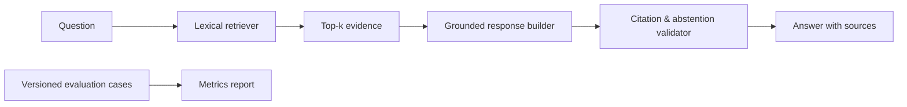

# Evidence RAG Workbench

A small but production-minded RAG prototype focused on the parts that make an assistant trustworthy: deterministic retrieval, grounded answers, citations, abstention, and repeatable evaluation.

## Why this project

Many RAG demos stop after retrieving chunks. This workbench adds explicit checks that every answer cites retrieved evidence and that the system abstains when the corpus does not support a question.



## Run it

```bash
python3 demo.py
python3 evaluate.py
python3 -m unittest discover -s tests -v
```

## Design decisions

- **No invented facts:** the response builder only uses the top retrieved passage and emits its source ID.
- **Safe fallback:** questions with no meaningful lexical overlap return an abstention rather than a fabricated answer.
- **Inspectable retrieval:** TF-IDF-like weighting is implemented with the standard library, making ranking behavior easy to review.
- **Measurable quality:** the evaluator reports answerability accuracy, citation validity, and abstention precision across a JSONL evaluation set.

## Next production step

Swap `retrieval.py` for an embedding/vector-store implementation while preserving the same `answer()` contract and evaluation cases. That keeps changes measurable rather than relying on subjective demos.
